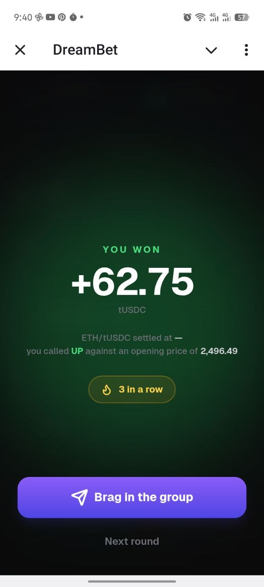

# DreamBet

**Bet on where BTC, ETH or SOL closes in the next few minutes — from inside a Telegram group, in two taps, without ever meeting a wallet.**

A Telegram Mini App on [dreamDEX](https://dreamdex.xyz) Event Contracts, running on the Somnia Network.



*A real win on Shannon: +62.75 tUSDC on ETH, three in a row, one tap from the group chat it came from.*

---

## Try it

**[t.me/thedreambetbot/dreambot](https://t.me/thedreambetbot/dreambot)** — open it from a group chat and the standings scope to that group.

Or run it:

```bash
npm install
cp .env.example .env.local   # add a Privy app id to enable signing
npm run dev
```

Open <http://localhost:3000>. The layout is locked to mobile dimensions and renders in a phone frame on wider screens. Without a Privy app id it still prices real markets — it just has nothing to sign with, and says so.

Test collateral is minted in the app: open the wallet sheet, tap **Get 10,000 tUSDC**, and it calls `faucet()` on the TestUSDC contract itself.

---

## What it does that is actually hard

### You never meet a wallet, and never think about gas

Telegram login creates an embedded Privy wallet behind the scenes. No seed phrase, no extension, no connect step — a Telegram webview has no injected provider, so an external wallet was never an option here anyway.

Gas is the app's problem, not the player's. Every public STT faucet wants a browser wallet to connect and a Mini App has none, so `POST /api/fund` drips from one sponsor key before a bet and before a collateral claim, and never to a wallet that already has enough.

Getting that right took measuring rather than guessing. Somnia settles at a flat 6 gwei, but a wallet is checked against `gas × maxFeePerGas`, and the wallet builds every transaction at a **60 gwei** cap — ten times the price actually paid. With the SDK's default 10,000,000 gas ceiling, placing a bet demanded **0.6 STT on hand** to burn 0.0036. Nobody could bet.

So the ceiling is measured: a DreamBet order burns **595,412 gas**, and the heaviest order any caller has sent to these pools burnt 3.65M. `WRITE_GAS` is 2,000,000, and every other number derives from it:

```
WRITE_RESERVE = WRITE_GAS × WRITE_MAX_FEE   →   0.12 STT
refill below  = RESERVE × 1.25              →   0.15 STT
refill to     = RESERVE × 2                 →   0.24 STT
```

They are one constant, not four, because when they were separate a player ended up **richer than the refill line and poorer than the reserve** — funded by the only measure the sponsor had, and refused by the chain. A rejected transaction burns nothing, so nothing moved them out of it. There is now a test that walks every balance from zero to target and asserts no such band exists.

### Everything on screen is the contract's answer

There is no locally-invented round. Windows, strikes, odds, and verdicts all come off dreamDEX, and the app is built to be honest when the venue is not:

- **The venue rolls four cadences and its market creators are intermittent.** DreamBet prefers 15-minute windows, then falls back through 5-minute, hourly and 1-minute — all four queried at once, ranked afterwards, so the *empty* case is one round trip rather than four. The window it found is named everywhere it matters: the countdown, the trade ticket, and the share card.
- **Liveness is per asset.** BTC and ETH move together only because the same creator rolls them; SOL has been dark for days. Each pill reads its own liveness and a dark one dims, carries a dot and refuses the tap — rather than looking fine until you tap it.
- **Two resolution modes.** A reference market settles against its opening oracle print; a fixed-strike market carries the line in its own question and never posts one. Reading only the opening print made every fixed-strike window unbettable — half the board — with no error, just buttons that never came alive.
- **A void is never dressed as a loss.** The oracle declined to answer, the stake came back, and the record sheet says `Void` rather than a red zero.

### The group is the product

Everyone bets into the same public dreamDEX window — that is where the liquidity is, and a market invented for five friends would have nobody on the other side of it. The private part is the scoring.

A placed bet becomes a share card immediately, at the moment of most conviction, and again from the settlement screen where *"I won"* travels further than *"I bet"*. The link carries who, which asset and which side into a Telegram start parameter; the recipient lands on that asset with the **opposite** side named, because the sender's is taken.

Nothing on the leaderboard is taken on the player's word. A bet is written only once the chain confirms that exact transaction was sent by that exact address, and **the result is never stored at all** — outcomes are read back off the market when the table is built, so the one thing worth lying about cannot be sent.

### Market Pulse

The panel no exchange gives you, because no exchange is betting on a fifteen-minute window: **how far the line is, measured in how far this asset actually travels in the time left.**

> *"BTC is 0.05% above the line, which is about 2 minutes of movement — UP is ahead, but the line is still in reach."*

0.05% means nothing alone. It means a great deal once you know BTC covers it in a typical minute and the window has four of them to run. A track draws the same comparison in space: the shaded band is everything reachable before expiry, and the dot drifts outward on its own as the clock runs down.

Underneath: the median one-minute move from real oracle prints, how the last six windows actually settled read off the contracts, resting book depth, and how many of your group are already in. It describes and never advises — a test asserts the copy never reaches for *bet*, *should*, *likely*, *will* or *predict*.

### A result you cannot miss

The settlement takeover was unreachable until recently: the round moved to `settled` because a verdict arrived, and that transition dropped the watch that produced it. Fixed — and the open bet is now remembered across launches, so a window that closed while Telegram was shut shows its result the next time the app opens, marked *"settled while you were away"*.

A win overshoots: the bloom swells past its resting size, eighteen sparks burst from behind the number, the figure springs past its own scale, and a second haptic beat lands with it. A loss stays deliberately quiet — a miss is not a failure, and an app that performs at somebody who just lost money is one they close.

---

## Verified, not asserted

```bash
npm run verify           # offline and deterministic — what CI gates on
npm run verify:dreamdex  # the above, plus the live Shannon deployment
```

`verify` covers the assumptions this code makes about itself: payout economics, stake sizing over a book, fill accounting, settlement direction, streak maths, the scoring rule shared by the standings and the history, the challenge-link parser, and the gas arithmetic above. No network, so a failure is always this repo's.

`verify:dreamdex` adds strike scaling, window shape, oracle prints, per-asset liveness and live book depth read off Shannon. Those assertions describe a third-party venue that times out, goes stale and stops rolling windows on its own schedule — real information, but not a regression here, which is why CI runs them without gating on them.

Both suites read as sentences, because a failing check should say what broke rather than which line number did:

```
PASS  a fixed-strike window's line is its strike, with no opening print needed
PASS  there is no balance that is both funded and unable to transact
PASS  a void costs nothing, whichever side it was on
PASS  the copy never advises a side
```

---

## Architecture

```
src/
  app/page.tsx              screen composition + round state machine
  app/api/fund              gas sponsorship (holds the signing key)
  app/api/board             standings, verified against chain receipts
  app/api/board/window      who from your group is in this window
  app/api/board/history     your own settled bets
  components/               TopBar, AssetSelector, PriceWidget, Sparkline,
                            CountdownBar, MarketSentiment, PredictButtons,
                            TradeTicket, PositionCard, SettlementOverlay,
                            PulseSheet, RecordSheet, LeaderboardList
  hooks/useDreamdexWindow   the live window: market, boundary, odds
  hooks/useAssetLiveness    which pills have anything behind them
  hooks/useMarketPulse      past verdicts, book depth, the group's bets
  hooks/useStakeQuote       what a stake buys, sized over the resting book
  hooks/usePriceFeed        oracle prints, read off the 1m market series
  hooks/useEventWindow      countdown driven by the market's own expiry
  hooks/useSettlement       waits for the contract's verdict
  hooks/usePlayerRecord     streak, win rate, rounds — from settled bets
  hooks/usePlayerHistory    the receipts behind those figures
  lib/dreamdex/config       network, collateral, cadences, gas arithmetic
  lib/dreamdex/market       indexer rows normalised; odds from price
  lib/dreamdex/oracle       price history, read off the 1m series' strikes
  lib/dreamdex/book         stake -> shares, walked over the live book
  lib/dreamdex/trade        placing the order, and reading back its fills
  lib/pulse                 the market read, and the words for it
  lib/position-store        the open bet, remembered across launches
  lib/challenge             challenge links: build, parse, share copy
```

**Stack:** Next.js 14 (App Router) · Tailwind · Framer Motion · `@telegram-apps/sdk-react` · Privy embedded wallets · viem · `@somnia-chain/markets-sdk` · Upstash Redis for standings.

### How a bet works

1. `useDreamdexWindow` queries all four traded cadences at once and picks the nearest window that is genuinely open, then reads the line it settles against — the strike for a fixed market, the opening print for a reference one.
2. Tapping a side opens the ticket, which sizes the typed stake against the pool's resting asks — so the multiplier shown is the one this order can actually get, slippage included, not the top-of-book number it would miss.
3. Confirm places a market IOC at the protective limit. UP buys YES, DOWN buys NO; outcome 0 is YES. The collateral approval and the order are two transactions, because ERC-20 requires the pool to be authorised and every window is a new pool.
4. The position is recorded from the transaction's own fills, never from the quote — the book can move between them, and only one of the two is a receipt.
5. `useSettlement` waits for the market to resolve and reads `winningOutcome` off the contract.

### Running outside Telegram

Everything degrades rather than breaks. Haptics become no-ops, native share falls back to the clipboard, `?startapp=` in the address bar stands in for a Telegram start parameter, and the "this group" leaderboard is disabled because there is no `chat_instance` to scope it by.

---

## For mainnet

DreamBet runs on Somnia's Shannon testnet today: the venue is live, the contracts are real, and nothing on screen is simulated — only the collateral is free. Pointing at mainnet is one env var — `NEXT_PUBLIC_SOMNIA_NETWORK=mainnet` switches chain, collateral and decimals — plus these, which real money makes worth building:

- **Withdrawals.** An amount-and-recipient screen doing an ERC-20 transfer of collateral through the existing signer, and Privy's key export alongside it, so the embedded wallet is genuinely the player's and reaching their own funds never depends on this app being up. Testnet collateral is faucet-minted and worth nothing, so today the wallet only needs to receive.
- **A funded, monitored sponsor.** The gas key currently underwrites every new player at 0.24 STT. On mainnet that wants alerting and a per-address cap rather than a wallet somebody tops up by hand.
- **More assets, as the venue lists them.** SOL is already in the pill row and reads as paused because dreamDEX has never rolled a SOL market. The moment one appears it goes live with no code change.
