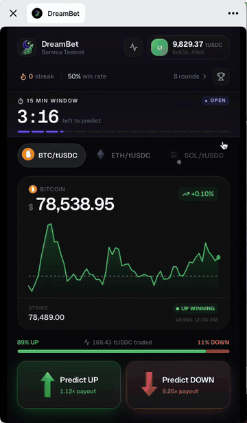

<p align="center">
  
</p>

<p align="center">
  <b>Bet on where BTC or ETH closes in the next fifteen minutes — from inside a Telegram group, with no install, no seed phrase and no gas to buy.</b>
</p>

<p align="center">
  A Telegram Mini App on <a href="https://dreamdex.xyz">dreamDEX</a> Event Contracts, running on the Somnia Network.
</p>

<p align="center">
  <b>Open it in Telegram: <a href="https://t.me/thedreambetbot/dreambet?startapp">t.me/thedreambetbot/dreambet?startapp</a></b>
</p>

<p align="center">
  
  <br>
  <sub>A real bet, start to finish: <a href="https://shannon-explorer.somnia.network/tx/0x00f9b5de0b5ba5b0fc34ee55a4d2de371c507c4a51763dc6686bfa7f4c8e110b">this transaction</a> on Shannon. The wallet prompts are sped up and the wait for the window to close is cut.</sub>
</p>

---

## The argument happens in the group chat. The market doesn't.

Someone posts a chart. Someone says it's going down. Everyone has an opinion and nobody has a position, because taking one means leaving the conversation: install a wallet, write down a seed phrase, find some gas, bridge collateral, learn what a strike is, and come back twenty minutes later to a chat that has moved on.

That gap is why crypto prediction markets are a spectator sport for almost everyone. The people with the strongest opinions are the least likely to have the toolchain, and the moment worth betting on lasts about ninety seconds.

The on-chain venues have the mirror-image problem. dreamDEX runs real event contracts on Somnia with real order books — and reaches the small population already carrying a wallet and already looking at a DEX.

## Put the market where the argument already is

DreamBet is a Telegram Mini App, so it opens inside the conversation. No install, no download, no context switch.

**Your Telegram account is the login.** An embedded wallet is created behind it the first time you open the app, so there is no seed phrase to write down. An external wallet was never an option anyway: a Telegram webview has no injected provider.

**Gas is never the player's problem.** Public STT faucets all want a browser wallet, and a Mini App doesn't have one. So the app pays instead: before every tUSDC claim and every bet, a sponsor key tops the player's wallet up if it is running low. DreamBet's own screens never mention gas.

**A bet is a side and an amount.** Tap UP or DOWN, pick a stake, confirm, then sign the two transactions the wallet asks for: the approval and the order. The odds come from the live order book, the window from the contract, and the result from the chain.

**And the bet leaves as an invitation.** A placed bet becomes a share card sent back to the group it came from, naming the *opposite* side, because yours is taken. Everyone bets into the same public dreamDEX window, where the liquidity is. What belongs to the group is the scoreboard between you and the people in that chat.

---

## The product

*Every figure in these screens is real: live dreamDEX windows, quotes walked off the resting book, and results the chain actually resolved.*

<table align="center">
<tr>
<td align="center" width="33%"><br><sub><b>The board</b></sub></td>
<td align="center" width="33%"><br><sub><b>The ticket</b></sub></td>
<td align="center" width="33%"><br><sub><b>The open bet</b></sub></td>
</tr>
</table>

**The board.** Three asset pills. One with no live market behind it is dimmed and can't be tapped, instead of looking fine until you press it. Below them, a price chart built from oracle prints with the line your bet settles against drawn across it, and a countdown that says which window it is counting: *15 min window*, *1 hour window*.

**The ticket.** Tap UP or DOWN and a sheet asks how much. The payout is quoted by walking the pool's resting asks, so the multiplier on screen is what your order will actually get, slippage included — not the top-of-book price it would miss. Once it fills, the bet sits under the chart with its strike, the live price and what it pays, marked *winning* or *losing* as the price crosses the line.

<table align="center">
<tr>
<td align="center" width="33%"><br><sub><b>Market Pulse: too close</b></sub></td>
<td align="center" width="33%"><br><sub><b>Market Pulse: clear lead</b></sub></td>
</tr>
</table>

**Market Pulse** shows **how far the price is from the line, measured in how far this asset normally moves in the time left.** Exchanges don't show this, because nobody on an exchange is betting on a fifteen-minute window.

> *"BTC is 0.05% above the line, which is about 2 minutes of movement — UP is ahead, but the line is still in reach."*

0.05% means nothing on its own. It means a great deal once you know BTC typically covers it in two minutes and there are four minutes to run. A track draws the same comparison in space — the shaded band is everything reachable before expiry, and the dot drifts outward on its own as the clock runs down. Underneath: the median one-minute move from real prints, how the last six windows actually settled, resting book depth, and how many of your group are already in.

It describes and never advises. A test asserts the copy never reaches for *bet*, *should*, *likely*, *will* or *predict*.

<table align="center">
<tr>
<td align="center" width="33%"><br><sub><b>A win</b></sub></td>
<td align="center" width="33%"><br><sub><b>A miss</b></sub></td>
<td align="center" width="33%"><br><sub><b>Your record</b></sub></td>
</tr>
</table>

**The result.** A full-screen takeover the moment the window closes. A win overshoots — the bloom swells past its resting size, eighteen sparks burst from behind the number, a second haptic beat lands with it. A loss stays quiet on purpose: an app that puts on a show for someone who has just lost money is an app they close.

And it waits for you. The open bet is remembered across launches, so a window that closed while Telegram was shut shows its result the next time you open the app, marked *settled while you were away*. Every settled bet then lands in your record: streak, win rate, best run, and the bets behind them.

<table align="center">
<tr>
<td align="center" width="33%"><br><sub><b>The share card</b></sub></td>
<td align="center" width="33%"><br><sub><b>A challenge arriving</b></sub></td>
<td align="center" width="33%"><br><sub><b>The standings</b></sub></td>
</tr>
</table>

**The group.** It starts with the share card, sent back into the chat the bet came from. Whoever taps it lands on the same window with a banner naming the side still open. The ticket stays shut until they choose to open it: tapping a friend's link and finding a payment dialog already up would feel like an ambush.

Then the standings, for the chat you launched from or for everyone who has played, plus a per-window tally of who is already in. Nothing on that table is taken on your word. A bet is written only once the chain confirms that exact transaction was sent by that exact address, and **the result is never stored at all**: outcomes are read back off the market every time the table is built, so nobody can submit a win they didn't have.

---

## Try it

1. **Open [t.me/thedreambetbot/dreambet?startapp](https://t.me/thedreambetbot/dreambet?startapp) in Telegram.** Post it in a group chat and open it from there if you want the "This group" standings. Sign in with Telegram, and your wallet is created behind it.
2. **Get test money.** Tap your balance in the top-right corner, then **Get 10,000 tUSDC**. The app covers the gas.
3. **Bet.** Tap UP or DOWN, pick a stake, tap **Confirm Prediction**, and approve the two wallet prompts.
4. **Wait for the window to close.** You can leave Telegram in the meantime; the result is waiting when you come back. Then tap **Challenge Friends in Group** to send the other side to the chat.

The trailing `?startapp` is what makes the link launch the Mini App rather than open a chat with the bot. Every challenge link the app generates carries it too, with the challenge encoded in it.

### Check it on-chain

Every bet in the app is an ordinary dreamDEX order that anyone can look up on the [Shannon explorer](https://shannon-explorer.somnia.network). The one in the GIF above:

| | |
|---|---|
| The bet | [`0x00f9b5de…e110b`](https://shannon-explorer.somnia.network/tx/0x00f9b5de0b5ba5b0fc34ee55a4d2de371c507c4a51763dc6686bfa7f4c8e110b) — a 10 tUSDC stake on BTC UP. 9.79 filled, and the 0.21 the book couldn't fill came back in the same transaction |
| That window's pool | [`0x898002B0B95FBEDF76c15A650ed0dE23cD6fC113`](https://shannon-explorer.somnia.network/address/0x898002B0B95FBEDF76c15A650ed0dE23cD6fC113) — every window is its own pool, which is why each one needs its own approval |
| Collateral (TestUSDC) | [`0x70a86D8842FB63C4Ad2b7cdddF530eBf1BB25d8E`](https://shannon-explorer.somnia.network/address/0x70a86D8842FB63C4Ad2b7cdddF530eBf1BB25d8E) — the faucet the wallet sheet calls |
| dreamDEX MarketsCore | [`0x2802504314685D89bF6C992CA5a8e7cC78bc0294`](https://shannon-explorer.somnia.network/address/0x2802504314685D89bF6C992CA5a8e7cC78bc0294) |
| dreamDEX OracleHub | [`0xe40db387cC98601Dd11bd634fF2f3AD5686dE32b`](https://shannon-explorer.somnia.network/address/0xe40db387cC98601Dd11bd634fF2f3AD5686dE32b) |

---

## Under the hood

### Run it and test it

```bash
npm install
cp .env.example .env.local   # add a Privy app id to enable signing
npm run dev
```

The layout is locked to mobile dimensions and renders in a phone frame on wider screens. Without a Privy app id it still prices real markets — it just has nothing to sign with, and says so. Test collateral is minted in-app: open the wallet sheet and tap **Get 10,000 tUSDC**, which calls `faucet()` on the TestUSDC contract itself.

The logic behind those screens is covered by two suites:

```bash
npm run verify           # offline and deterministic — what CI gates on
npm run verify:dreamdex  # the above, plus the live Shannon deployment
```

`verify` covers what this code assumes about itself: payout economics, stake sizing over a book, fill accounting, settlement direction, streak maths, the scoring rule, the challenge-link parser and the gas arithmetic below. No network, so a failure is always this repo's.

`verify:dreamdex` adds strike scaling, window shape, oracle prints, per-asset liveness and live book depth read off Shannon. That venue times out and goes stale on its own schedule, so CI runs these without gating on them.

Every check reads as a sentence, so a failure says what broke rather than which line did:

```
PASS  a fixed-strike window's line is its strike, with no opening print needed
PASS  there is no balance that is both funded and unable to transact
PASS  a void costs nothing, whichever side it was on
PASS  the copy never advises a side
```

### How a bet works

1. `useDreamdexWindow` queries every cadence dreamDEX trades (15-minute, 5-minute, hourly and 1-minute) at once, picks the first one in that order with a window genuinely open, and reads the line it settles against — the strike for a fixed market, the opening print for a reference one.
2. The ticket sizes the typed stake against the pool's resting asks, so the multiplier shown is the one this order can actually get.
3. Confirm places a market IOC at the protective limit. UP buys YES, DOWN buys NO; outcome 0 is YES. The approval and the order are two transactions, because ERC-20 requires the pool to be authorised and every window is a new pool.
4. The position is recorded from the transaction's own fills, never from the quote — the book can move between them, and only one of the two is a receipt.
5. `useSettlement` waits for the market to resolve and reads `winningOutcome` off the contract.

### Gas, measured rather than guessed

Somnia settles at a flat 6 gwei, but a wallet is checked against `gas × maxFeePerGas`, and the wallet builds every transaction at a **60 gwei** cap — ten times the price actually paid. With the SDK's default 10,000,000 gas ceiling, placing a bet demanded **0.6 STT on hand** to burn 0.005. Nobody could bet.

So the ceiling is measured: a DreamBet order burns **828,682 gas** ([the demo bet](https://shannon-explorer.somnia.network/tx/0x00f9b5de0b5ba5b0fc34ee55a4d2de371c507c4a51763dc6686bfa7f4c8e110b) is one), and the heaviest order any caller has sent to these pools burnt 3.65M. `WRITE_GAS` is 2,000,000, and every other number derives from it:

```
WRITE_RESERVE = WRITE_GAS × WRITE_MAX_FEE   →   0.12 STT
refill below  = RESERVE × 1.25              →   0.15 STT
refill to     = RESERVE × 2                 →   0.24 STT
```

They are one constant, not four, because when they were separate a player ended up **richer than the refill line and poorer than the reserve** — funded by the only measure the sponsor had, and refused by the chain. A rejected transaction burns nothing, so nothing moved them out of it. There is now a test that walks every balance from zero to target and asserts no such band exists.

### Event Contracts used as a price feed

The venue publishes no standalone price API, and it turns out not to need one. Every market on the 1-minute series is created with a **fixed** strike, and that strike is the oracle's spot at the block the market was created in. Reading a run of them back *is* the oracle's own minute-by-minute history — real prints, on exactly the scale the longer windows settle against, taken from the same contracts the bet resolves on rather than from some third-party ticker that could disagree with them.

The chart, the line drawn across it, and Market Pulse's typical-move figure all come out of that one observation. Reference-mode rows carry strike `0` as a sentinel, so they are dropped rather than plotted as a crash to zero.

### Honest about a venue that is not always there

There is no locally-invented round: windows, strikes, odds and verdicts all come off dreamDEX. Which means the app has to tell the truth when the venue is having a bad day.

- **Four cadences, in a preference order.** 15-minute windows first, falling back through 5-minute, hourly and 1-minute — all four queried at once and ranked afterwards, so the *empty* case is one round trip rather than four. The window it found is named on the countdown, the ticket and the share card, because a bet that settles in an hour must not be described as five minutes to the group receiving it.
- **Liveness is per asset.** BTC and ETH move together only because the same creator rolls them; SOL's market has not gone live yet. Each pill reads its own.
- **Two resolution modes.** A reference market settles against its opening oracle print; a fixed-strike market carries the line in its own question and never posts one. Reading only the opening print made every fixed-strike window unbettable — half the board — with no error, just buttons that never came alive.
- **A void is never dressed as a loss.** The oracle declined to answer, the stake came back, and the record says `Void` rather than a red zero.

### Running outside Telegram

Everything degrades rather than breaks. Haptics become no-ops, native share falls back to the clipboard, `?startapp=` in the address bar stands in for a Telegram start parameter, and the "this group" leaderboard is disabled because there is no `chat_instance` to scope it by.

### Architecture

```
src/
  app/page.tsx              screen composition + round state machine
  app/api/fund              gas sponsorship (holds the signing key)
  app/api/board             standings, verified against chain receipts
  app/api/board/window      who from your group is in this window
  app/api/board/history     your own settled bets
  components/               TopBar, AssetSelector, PriceWidget, Sparkline,
                            CountdownBar, MarketSentiment, PredictButtons,
                            TradeTicket, PositionCard, SettlementOverlay,
                            PulseSheet, RecordSheet, LeaderboardList
  hooks/useDreamdexWindow   the live window: market, boundary, odds
  hooks/useAssetLiveness    which pills have anything behind them
  hooks/useMarketPulse      past verdicts, book depth, the group's bets
  hooks/useStakeQuote       what a stake buys, sized over the resting book
  hooks/usePriceFeed        oracle prints, read off the 1m market series
  hooks/useEventWindow      countdown driven by the market's own expiry
  hooks/useSettlement       waits for the contract's verdict
  hooks/usePlayerRecord     streak, win rate, rounds — from settled bets
  hooks/usePlayerHistory    the receipts behind those figures
  lib/dreamdex/config       network, collateral, cadences, gas arithmetic
  lib/dreamdex/market       indexer rows normalised; odds from price
  lib/dreamdex/oracle       price history, read off the 1m series' strikes
  lib/dreamdex/book         stake -> shares, walked over the live book
  lib/dreamdex/trade        placing the order, and reading back its fills
  lib/pulse                 the market read, and the words for it
  lib/position-store        the open bet, remembered across launches
  lib/challenge             challenge links: build, parse, share copy
```

**Stack:** Next.js 14 (App Router) · Tailwind · Framer Motion · `@telegram-apps/sdk-react` · Privy embedded wallets · viem · `@somnia-chain/markets-sdk` · Upstash Redis for standings.

---

## Why this grows dreamDEX

**It reaches people who are not looking for a DEX.** The distribution is a link in a chat somebody is already reading. The people it puts in front of Event Contracts are not traders shopping for a venue; they are the ones already arguing about the price.

**Every bet asks for a counterparty.** The share card names the *opposite* side of the *same* window, so the loop adds order flow to both sides of one book, not just users. Six people arguing about BTC in a group chat become six orders in the same fifteen minutes, on dreamDEX's own liquidity.

**It teaches Event Contracts without a tutorial.** Nobody has to learn what a strike, an outcome token or an IOC is. They see a line on a chart, two buttons and a payout. Market Pulse does the same for volatility, stating distance to the line in minutes of ordinary movement.

**It is a template, not a fork.** Any asset dreamDEX lists appears in the pill row with no code change, and the same shell works for any binary window the venue rolls.

**And it can pay for itself with the venue's own builder fee.** A player opts a frontend in with `approveBuilder`, up to a ceiling the venue sets, and each order then pays that frontend a share. No custom contracts, no invented rake, and nothing taken without the player's approval.

Nothing is charged today. `maxBuilderFeeBps` reads as null on every Shannon market, so the ceiling hasn't been published and no rate is named here. The cost side is already known, because the sponsor pays all of it:

| Gas the sponsor pays | STT |
|---|---|
| Filling a new player's wallet before their first transaction (mostly a float that stays there) | 0.24 |
| Each bet after that (approval + order) | ~0.0065 |
| Each refill, about every fourteen bets | ~0.09 |

The fee is a share of the stake and the gas is a flat cost per bet, so above some stake every bet pays for its own gas. Three levers close the gap, none of which needs anything new built:

- **A minimum stake** at that break-even point.
- **A per-address sponsorship cap,** so each player's float is a fixed cost of acquiring them.
- **Players paying their own gas past the cap.** On mainnet the wallet sheet already shows an address and QR code to send SOMI to, so sponsorship becomes onboarding rather than a permanent subsidy.

---

## Where it goes

DreamBet runs on Somnia's Shannon testnet today: the venue is live, the contracts are real, and nothing on screen is simulated — only the collateral is free.

**Mainnet** is one env var for the chain, collateral and decimals, plus three things real money makes worth building:

- **Withdrawals.** An amount-and-recipient screen doing an ERC-20 transfer through the existing signer, with Privy's key export beside it — so the embedded wallet is genuinely the player's, and reaching their own funds never depends on this app being up.
- **A sponsor that is watched, and capped.** The key paying for everyone's gas has two guards it does not have yet: an alert before it empties, because the failure mode is that new players cannot start and existing ones run dry a few bets later, silently, at exactly the moment the app is working; and a per-address cap, because today nothing stops fifty accounts draining it 0.24 at a time.
- **More assets, as the venue lists them.** SOL is already in the pill row and reads as paused because the SOL market on dreamDEX has not gone live yet. The moment it does, the pill lights up with no code change.

**Beyond that, the group is the thing to build on.** The standings already know which Telegram chat every bet came from, which is the hard part. Seasons that reset, a group's leaderboard pinned in the chat, head-to-head records between two people who keep taking opposite sides — none of that needs new on-chain machinery, only more done with the identity the app already has.

The bet is that prediction markets do not grow by finding more traders. They grow by reaching the people already arguing about the price, in the place they are already arguing.
